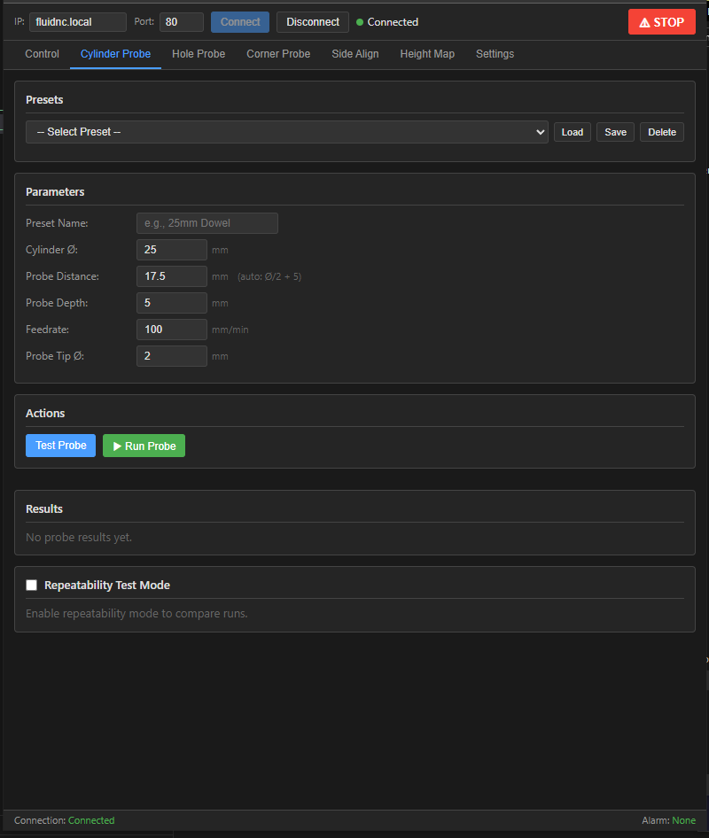
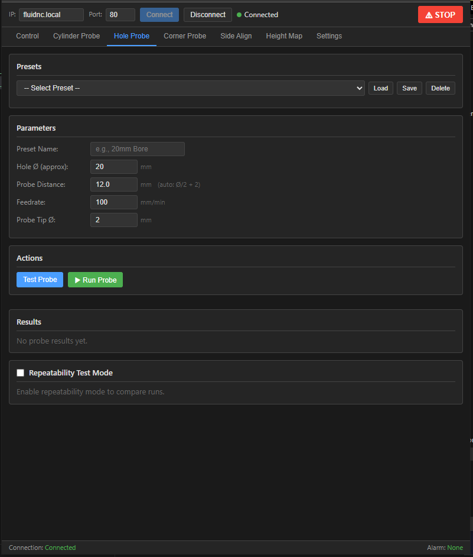
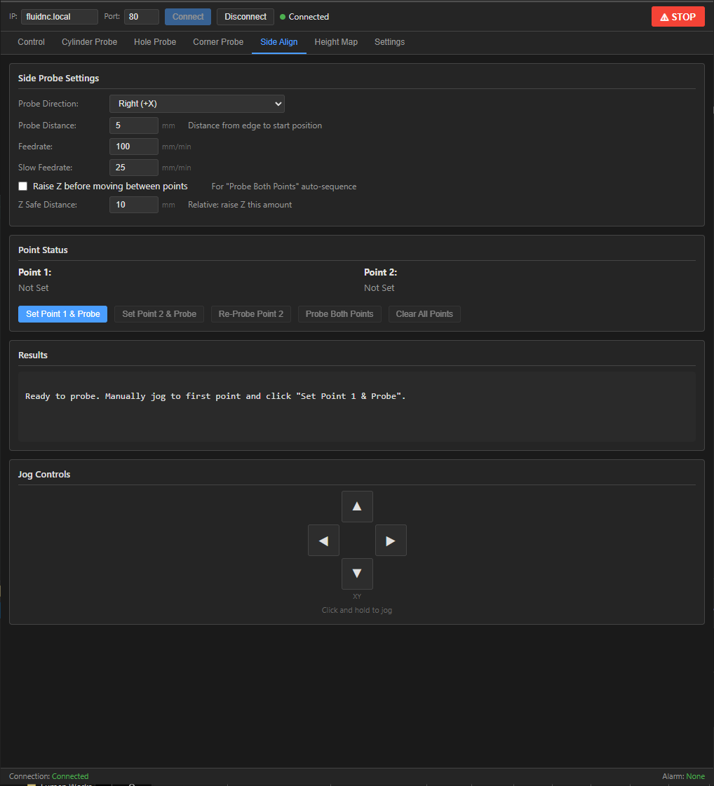
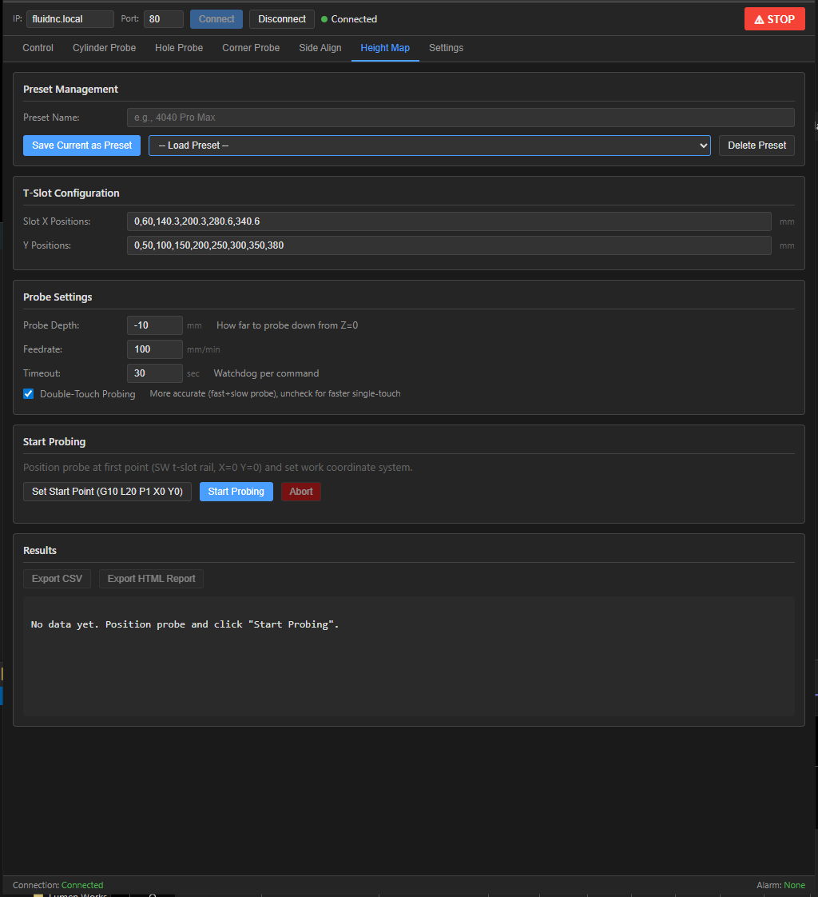
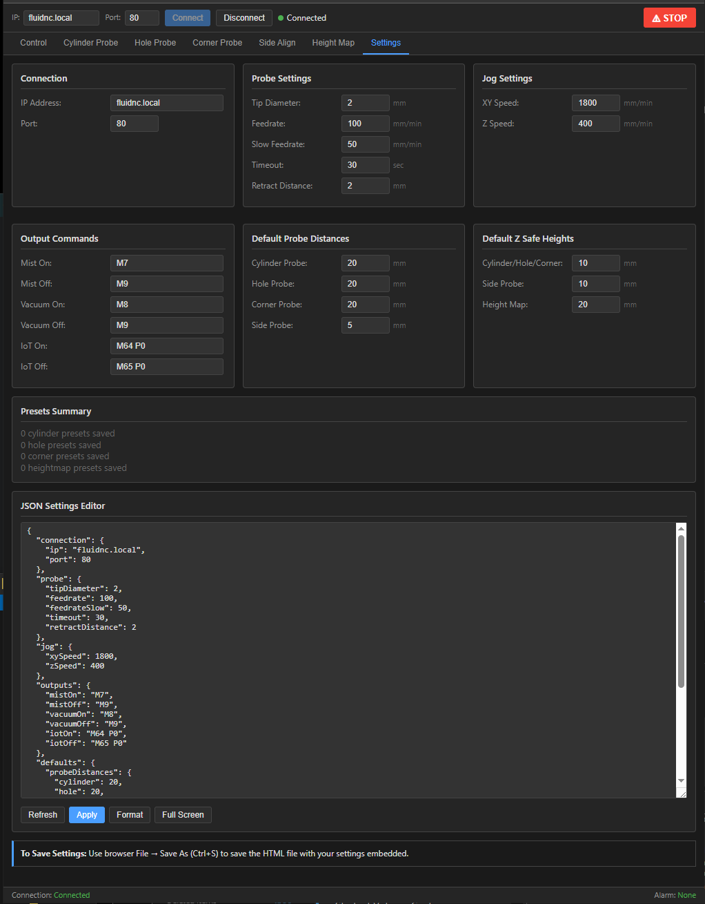

# FluidNC Probe Utility

A portable, single-file web utility for CNC probe operations and machine control with FluidNC controllers. Open the HTML file in any browser, enter your controller's IP address, and connect — no installation required.


---

## Features

- **Zero install** — One self-contained HTML file. Open in Chrome, Firefox, or Edge.
- **Direct WebSocket connection** to FluidNC controller (port 81)
- **Portable settings** — Configuration is embedded in the HTML file; use browser Save-As (Ctrl+S) to save your settings permanently
- **Dark theme UI** — Easy on the eyes in the shop
- **Double-probe accuracy** — All probe operations use two-pass probing for precision
- **Preset management** — Save and recall settings for common workpieces

---

## Tab Overview

| Tab | Description |
|-----|-------------|
| [Control](#control-tab) | Position display, jogging, homing, outputs, machine position moves, position log, WCS manager, return points, tool offset, laser control |
| [Cylinder Probe](#cylinder-probe-tab) | External cylinder / boss center finding |
| [Hole Probe](#hole-probe-tab) | Internal hole / bore center finding |
| [Corner Probe](#corner-probe-tab) | Outside corner detection (SW / SE / NW / NE) |
| [Side Align](#side-align-tab) | Two-point alignment — check workpiece parallel to axis |
| [Height Map](#height-map-tab) | Grid-based T-slot surface height mapping |
| [Settings](#settings-tab) | All configuration, JSON editor, preset management |

---

## Screenshots

| Control | Cylinder Probe | Hole Probe |
|:---:|:---:|:---:|
|  |  |  |

| Corner Probe | Side Align | Height Map | Settings |
|:---:|:---:|:---:|:---:|
|  |  |  |  |

---

## Quick Start

1. Download the latest `FluidNC_Probe_Utility_v1.15.1.html`
2. Open it in Chrome, Firefox, or Edge
3. Enter your FluidNC controller IP address (check your router or FluidNC WebUI)
4. Click **Connect**
5. **Home the machine** before doing anything else (`Home All` on the Control tab)
6. Use the tabs for different operations

> **Settings are saved inside the HTML file.** After configuring feedrates, IP address, presets, etc., use **File → Save As** (Ctrl+S) in your browser and overwrite the file. Your settings survive the save.

---

## Requirements

- FluidNC controller with WebSocket enabled (port 81 — enabled by default)
- Modern web browser (Chrome, Firefox, Edge — no Internet Explorer)
- Touch probe connected to FluidNC probe input

---

## Control Tab

The Control tab is the main machine operation panel. It has two zones: a compact **4-section grid** at the top (Position, Home, Jog, Outputs), and a set of **full-width sections** below.

### Position Section
Displays Machine Position (absolute from homing switches) and Job Position (relative to G54 job origin).

- **Zero X / Zero Y / Zero Z** — Sets that axis's job origin to current machine position (`G10 L20 P1`)
- **Set Job Origin XY Here** — Sets XY job origin at current position. Shows an **↩ Undo** row with the previous offset that can be restored with one click.
- **Go to Job Origin XY / Go Z 0** — Rapid move to job origin
- **↻ Refresh** — Polls controller for current position (`?`)

### Home Section
- **Home All ($H)**, **Home X**, **Home Y**, **Home Z** — Always home before starting work

### Jog Section
- Click and hold arrow buttons for continuous jogging
- Jog speeds configured in Settings tab

### Outputs Section
- Toggle **Mist**, **Vacuum**, **IoT PDU** relay outputs (M-codes configured in Settings)

### Move to Machine Position
Move to an explicit machine coordinate using `G53` (bypasses job origin offset). Enter values and check the axes to move, then click **Go**. **← From Current** populates the fields with your current position.

### Position Log
Record machine and job positions during your session. Useful for measuring tool offsets and tracking positions across a job.
- **● Record** — Captures current position with a timestamp and editable label
- **Diff 2 Selected** — Select two entries and compute ΔX/Y/Z in both coordinate systems
- **Go** — Returns to any logged position via `G53 G0`

### Saved Job Origins (G54–G59)
View and manage all six WCS offset slots stored in the controller.
- **↻ Refresh from Controller** — Reads all six offsets from EEPROM (`$#`)
- **Go** — Move to the machine position stored in that slot
- **Set Here** — Make current position the origin for that slot (`G10 L20`)
- **Set Values** — Enter explicit machine coordinates (`G10 L2`)
- **Reset Job Origin G54 to Zero** — Clears G54 for LightBurn Absolute Coords mode

### Return Points (G28 / G30)
Two persistent parking spots stored in machine coordinates (survive power-off).
- **Save Here** — Records current machine position as Return Point 1 (`G28.1`) or 2 (`G30.1`)
- **Go There** — Returns to saved position after any home cycle

**Workflow:** Jog to your PCB corner → zero job XY → click Save Here. Next session: Home → Go There → job coordinates are automatically correct, no re-zeroing needed.

### Tool Offset — Spindle to Laser
Measures and stores the physical XY offset between your spindle and laser. Once measured, **Move Laser to Spindle Zero** moves the laser beam to where the spindle was zeroed.

### Active Tool
Switches between Spindle (T0) and Laser (T1) via `M6 T0` / `M6 T1`. The header badge updates to reflect the active tool. The Laser Control panel is disabled until Laser (T1) is selected.

### Laser Control
Fire the laser at controlled power levels for alignment and marking.
- **Low Power toggle** (1–10%) — Toggle on/off for beam alignment
- **Hold to Fire** (1–50%) — Fires only while button is pressed; auto-stops on release

> ⚠ Wear appropriate laser safety glasses (450nm OD4+). High power fires ONLY while the button is held.

### Alarm
**Unlock / Clear Alarm ($X)** — Use after an E-stop, limit switch trip, or soft reset. Verify the machine is safe before unlocking.

### Coordinate System Reference
An educational reference panel at the bottom of the Control tab explaining MCS, G54–G59 job origins, Return Points, Tool Offset, and G10 commands.

---

## Cylinder Probe Tab

Find the XY center of external cylindrical features (bosses, round stock, dowels).

1. Position probe tip approximately 2mm above the cylinder center at the desired Z height
2. Enter the approximate cylinder diameter
3. Click **Test Probe** to verify the probe pin connection
4. Click **Run Probe** — executes a 4-point, double-pass probe sequence (East, West, North, South)
5. Results show center X/Y and measured diameter
6. Use **Set XY0** to set the job origin at the measured center

**Tip diameter** is added to the measured distance to account for the probe ball size.

---

## Hole Probe Tab

Find the XY center of internal cylindrical features (holes, bores, pockets).

1. Position probe tip inside the hole, near center, at the desired Z height
2. Enter the approximate hole diameter
3. Click **Test Probe**, then **Run Probe**
4. Results show center X/Y and measured diameter
5. Use **Set XY0** to set the job origin at the center

**Key difference from Cylinder:** Hole probe moves outward from the center to the walls (tip diameter is subtracted, not added).

---

## Corner Probe Tab

Find the XY corner of rectangular workpieces. The probe does not move Z — position Z at the desired probe height before starting.

1. Manually jog Z to the desired probe height (mid-sidewall of workpiece)
2. Select **Corner Location** (SW / SE / NW / NE — from your perspective standing at the machine front)
3. Set **Start Distance** (typically 5mm from each wall) and **Travel Distance** (≥ start distance)
4. Click **Test Probe**, then **Run Probe**
5. Results show the corner XY position
6. Use **Set XY0** to set the job origin at the corner

**The probe does not move Z** — position it manually before running.

---

## Side Align Tab

Measure a workpiece edge at two points to verify it is parallel to an axis.

1. Select **Probe Direction** (which way the probe moves to find the edge)
2. Jog to Point 1 (~5mm from the edge) and click **Set Point 1 & Probe**
3. Jog along the workpiece (moving only the perpendicular axis) to Point 2 and click **Set Point 2 & Probe**
4. Results show the difference in edge position, the implied angle, and actionable correction instructions
5. Adjust the workpiece and click **Re-Probe Point 2** to verify, or **Probe Both Points** to auto-sequence

**Tolerance:** ✓ shown if within 0.01mm; otherwise shows how far (and which direction) to move the far end.

---

## Height Map Tab

Map the height of a T-slot work table across a configurable grid of X slot positions and Y positions.

1. Jog to the SW corner of the area to map, at a safe Z clearance above the surface
2. Click **Set Start Point** (sets this position as job origin)
3. Enter **Slot X Positions** (comma-separated, mm from start) and **Y Positions**
4. Configure probe depth, feedrate, and timeout
5. Click **Start Probing** — the machine probes each grid intersection in sequence
6. Export as **CSV** (for spreadsheet analysis) or **HTML** (color heatmap visualization)

**Double-touch mode** (default on): each point uses a fast probe + retract + slow probe for better accuracy.

---

## Settings Tab

Configure all utility parameters. Changes auto-save as you type; click **Apply Settings** to force-apply.

| Section | Settings |
|---------|----------|
| Connection | IP address, port |
| Probe | Tip diameter, fast/slow feedrates, retract distance, timeout |
| Jog | XY speed, Z speed |
| Laser | Low power default %, high power max % |
| Stored Tool Offset | X and Y offset (mm) — set automatically by Tool Offset measurement |
| Outputs | M-code commands for Mist, Vacuum, IoT on/off |
| Default Probe Distances | Auto-populate values when switching tabs |
| Default Z Safe Heights | Auto-populate Z clearance heights |
| Settings JSON | Direct JSON editor with full-screen mode (Esc to exit) |
| Presets | Summary of saved presets per probe type |

### Saving Settings

Settings are embedded directly in the HTML file. To save permanently:

1. Make your changes in the Settings tab
2. Press **Ctrl+S** (or File → Save As) in your browser
3. Save over the existing HTML file

Your settings — including all presets, IP address, feedrates, and tool offset — will be there the next time you open the file.

---

## Code Organization

The JavaScript is organized with VS Code-compatible region markers. Use `Ctrl+Shift+[` to fold/unfold:

```
#region ===== GLOBAL STATE =====
#region ===== SETTINGS MANAGEMENT =====
#region ===== WEBSOCKET CONNECTION =====
#region ===== MESSAGE HANDLING =====
#region ===== CONTROL TAB =====
#region ===== EMERGENCY STOP =====
#region ===== ZERO XY UNDO =====
#region ===== MCS MOVE =====
#region ===== POSITION LOG =====
#region ===== WCS / JOB ORIGINS MANAGER =====
#region ===== RETURN POINTS (G28 / G30) =====
#region ===== TOOL OFFSET =====
#region ===== TOOL & LASER =====
#region ===== ALARM CLEAR =====
#region ===== SHARED PROBE UTILITIES =====
#region ===== CYLINDER PROBE =====
#region ===== HOLE PROBE =====
#region ===== CORNER PROBE =====
#region ===== SIDE PROBE =====
#region ===== HEIGHT MAP =====
#region ===== SETTINGS TAB =====
#region ===== INITIALIZATION =====
```

---

## Technical Details

### Settings Persistence
Settings are stored in a `<script type="application/json" id="user-settings">` block inside the HTML file. When settings change, the block is updated in memory. Browser Save-As writes the current DOM (with updated settings) to disk.

### Coordinate Systems
- FluidNC reports Machine Position (MPos) in status reports (`<Idle|MPos:x,y,z|...>`)
- WCS offsets for G54–G59 are queried via `$#`
- WCS displayed = MCS minus G54 offset
- Probe results (`[PRB:...]`) are in machine coordinates; moves use `G53` for absolute positioning

### WebSocket Protocol
- Connects to `ws://<ip>:81/`
- Commands sent with `\n` terminator
- Handles both text and Blob WebSocket responses
- Listener-before-send pattern prevents race conditions in probe sequences

### Probe Sequence (all probe types)
1. Send command and wait for `ok` response (async/await)
2. Fast probe (`G38.2`) → capture `[PRB:...]` result
3. Retract
4. Slow probe → capture result
5. Average the two probe measurements
6. Repeat for all probe directions
7. Calculate center/corner/edge from averaged results

---

## Version History

See [CHANGELOG.md](CHANGELOG.md) for full version history.

Current version: **1.15.1** (2026-02-18)

---

## Contributing

1. Fork the repository
2. Create a feature branch
3. Test thoroughly with actual hardware
4. Submit a pull request

> **This software controls CNC machinery.** Test all changes carefully. Never bypass safety checks.

---

## License

MIT License — see [LICENSE](LICENSE)

## Author

John Sparks / Lumen Works Engineering

## Acknowledgments

- [FluidNC](https://github.com/bdring/FluidNC) project for the excellent CNC controller firmware
- gSender macros used as reference for probe sequences
